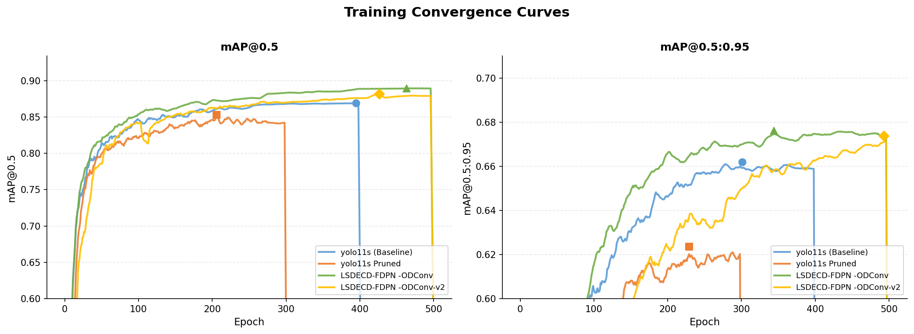
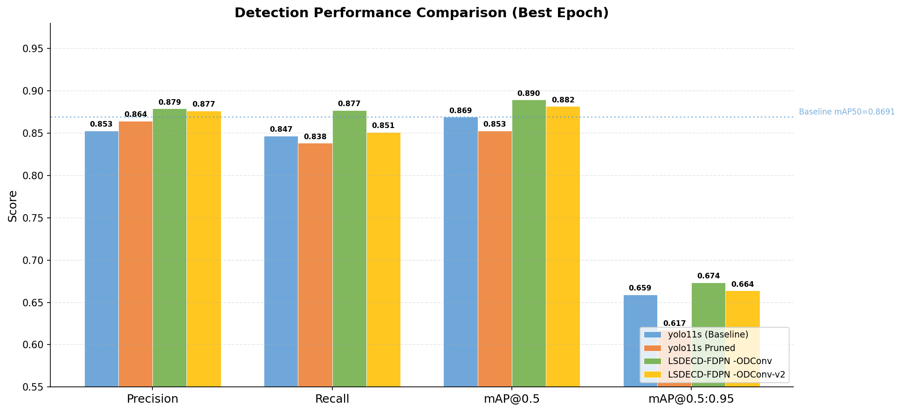
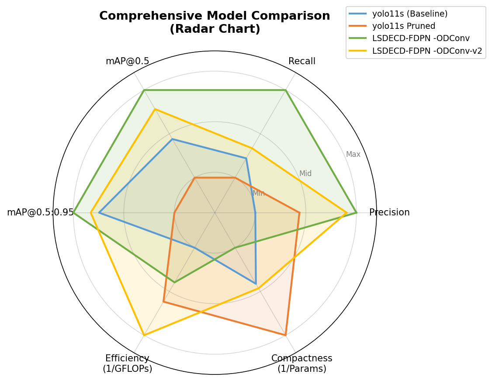

# rail-surface-defect-yolo11

**钢轨表面缺陷（划痕类）YOLO11 改进检测 —— LSDECD + FDPN + ODConv + 通道剪枝**

> 作品集/复现仓库：钢轨表面缺陷检测（4 类：`clipping` / `lightband` / `perlage` / `seams`）目标检测研究，包括模型结构改进与结构化通道剪枝压缩。
> 基于 Ultralytics YOLO11 的衍生改进，与已发表论文配套（见"论文引用"）。

---

## 亮点

- **LSDECD 检测头**：引入 `share_conv`（DEConv_GN 可变形卷积），针对细长划痕特征强化局部几何感知
- **FDPN（Feature Dimension Pyramid Network）**：改进特征金字塔网络，增强多尺度特征融合
- **ODConv（Omni-Dimensional Dynamic Convolution）**：全维度动态卷积
- **结构化通道剪枝**：约束"精度损失 ≤ 2% (mAP50-95)、参数量削减 ≥ 20%"下压缩模型（两个剪枝版本）
- 完整实验报告见 `docs/jianzhi/`，可视化图表见 [`docs/charts/`](docs/charts/)

## 实验结果图

| 训练收敛对比 | 性能柱状对比 | 综合能力雷达 |
|---|---|---|
|  |  |  |

*完整图表集（效率气泡图/验证损失/海报等 7 张）见 [`docs/charts/`](docs/charts/)*

## 模型对比（验证集最佳 epoch，详见 docs/jianzhi/model_comparison_report.md）

| 模型 | Params/M | GFLOPs/G | 说明 |
|---|---|---|---|
| yolo11s（官方基线） | 9.43 | 21.55 | baseline |
| yolo11s-rail-pruned-conservative | 8.55 | 18.19 | 基线保守剪枝 |
| **LSDECD-FDPN-ODConv** | 10.16 | 19.26 | 完整改进版 |
| **LSDECD-FDPN-ODConv-pruned-v2** | 9.35 | 16.58 | 改进版 + 通道剪枝 |

## 仓库结构

```
rail-surface-defect-yolo11/
├── ultralytics/          # YOLO11 改进版（含 extra_modules：LSDECD/FDPN/ODConv 实现）
│   └── cfg/models/gaijin11/   # 自定义模型结构 yaml
├── weights/
│   ├── LSDECD-FDPN-ODConv-best.pt          # 改进版权重 (19.8MB)
│   ├── LSDECD-FDPN-ODConv-pruned-v2-best.pt # 剪枝版权重 (18.3MB)
│   └── yolo11s-baseline-best.pt            # 基线权重 (18.3MB)
├── docs/
│   ├── jianzhi/
│   │   ├── model_comparison_report.md          # 模型对比报告
│   │   ├── pruning_technical_report.md         # 剪枝技术报告
│   │   └── *.yaml                              # 剪枝结构配置
│   └── charts/                                 # 收敛曲线/柱状/雷达图等
├── train.py / val.py / detect.py / export.py / my_export.py
├── data.yaml           # 数据集说明（图片数据不随仓库发布，见下）
└── requirements.txt
```

## 快速使用

```bash
# 环境（Python 3.10/3.11 + GPU 推荐）
pip install -r requirements.txt

# 引擎自检（导入/权重加载/CPU 推理，~10s）
python scripts/selfcheck.py
# 期望输出:
#   [OK] import ultralytics (8.3.9)
#   [OK] 权重加载 LSDECD-FDPN-ODConv-best.pt
#   [OK] 端到端推理 (CPU dummy 图)

# 推理（用改进版权重）
python detect.py --weights weights/LSDECD-FDPN-ODConv-best.pt --source <图片或视频>

# 目标检测训练（需准备数据集，见 data.yaml）
python train.py --data data.yaml --cfg ultralytics/cfg/models/gaijin11/LSDECD-FDPN-ODConv.yaml --weights weights/LSDECD-FDPN-ODConv-best.pt
```

> 依赖：ultralytics 改进版即本仓库内 `ultralytics/`（无需 pip 单独安装 ultralytics，直接使用仓库内代码）。

## 数据集说明（重要）

训练数据为钢轨表面缺陷标注集（Roboflow 风格，4 类：clipping/lightband/perlage/seams）。**原始图像与标注文件不随本仓库发布**（涉及数据版权与来源许可）。`data.yaml` 提供类别结构与训练/验证划分定义；如需复现训练，请联系论文作者获取数据或使用等价公开钢轨缺陷数据集（如 NEU-DET 等）按相同标签映射。

## 论文引用

本仓库与已发表的钢轨表面缺陷检测改进论文配套（LSDECD + FDPN + ODConv 方法与剪枝实验），
研究细节（方法描述、实验设置、完整指标表）见 [`docs/jianzhi/`](docs/jianzhi/) 报告。
如需引用，请联系仓库维护者获取论文信息。

## 许可

- 本仓库自研改进代码（`ultralytics/nn/extra_modules/` 中 LSDECD/FDPN/ODConv 相关实现、`gaijin11` 配置、实验脚本）：**MIT License**（见 LICENSE）
- **Ultralytics 上游代码**（`ultralytics/` 其余部分）遵循上游 **AGPL-3.0**，衍生修改一并按 AGPL-3.0 分发（引用 ultralytics/ultralytics）

> 使用提醒：若用于发表论文/竞赛，请遵循 AGPL-3.0 与数据来源方（Roboflow/标注作者）的许可要求，并与原论文作者确认引用方式。